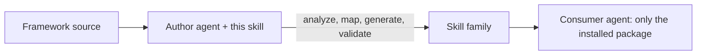

# framework-skill-authoring

A **meta-skill**: a skill that builds skills.

Point it at a framework you have the **source** for, and it generates a
self-contained Agent Skills family that another agent can use later with only
the **installed package** (wheel/jar) — no source, no repo, no docs.



## Usage

Open the target framework's codebase and run:

```
use framework-skill-authoring, and based on it, and available files in the
repo build me skills for <your framework> framework
```

Then verify:

```
verify correctness of everything you built vs the code/docs — no
hallucinations, invalid references, or typos in function/attribute names
```

The agent must have the framework **source**; it can't author from a black box.

## How it works — four phases

1. **Analyze** the source — public API, config object, declarative models, CLI,
   runtime doc APIs, critical user journeys, decision points.
2. **Map** to a universal capability taxonomy; emit only domains the framework has.
3. **Generate** the workspace-instructions file, an entry router, and one skill
   per capability.
4. **Validate** — lint + a no-source consumer simulation of each journey.

**Golden rule:** everything the consumer needs lives inside the skills — no
source paths, copy-pasteable examples, cross-link by skill name, no org leakage.

## Layout

```
framework-skill-authoring/
├── SKILL.md              # meta-skill entry point
├── references/           # phase-by-phase playbook
└── assets/templates/     # ready-to-fill skeletons
```

Install this meta-skill by placing `framework-skill-authoring/` in your agent's
skills directory (e.g. `~/.agents/skills/`).

## Installing the generated skill family

The output is a folder of skills. Drop it where your consumer agent reads skills:

- **Local agent (Claude, Cursor, etc.):** copy each generated skill folder into
  `~/.agents/skills/` (or the project's `.agents/skills/`).
- **Databricks Genie Code:** put each skill folder under `.assistant/skills/` —
  `Workspace/.assistant/skills/` for workspace-wide, or
  `/Users/{username}/.assistant/skills/` for personal. Each skill needs its own
  folder with a `SKILL.md`. Genie Code loads them in Agent mode; start a new
  thread after edits. See
  [Extend Genie Code with agent skills](https://docs.databricks.com/aws/en/genie-code/skills).
