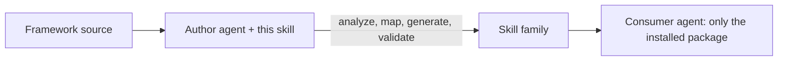

# framework-skill-authoring

A **meta-skill**: a skill that builds skills.

Point it at a framework you have the **source** for, and it generates a
self-contained Agent Skills family that another agent can use later with only
the **installed package** (wheel/jar) — no source, no repo, no docs.

It's geared mainly toward **data engineering** frameworks, but works just as
well for ML/data-science libraries or anything you'd typically run on
Databricks. The capability taxonomy is broad enough to map most code
frameworks.



## This repository

```
framework-skill-authoring/
├── SKILL.md              # meta-skill entry point
├── references/           # phase-by-phase playbook
└── assets/templates/     # ready-to-fill skeletons
```

Install this meta-skill by placing `framework-skill-authoring/` in your agent's
skills directory (e.g. `~/.agents/skills/`).

## Usage

Open the target framework's codebase and run:

```
use framework-skill-authoring, and based on it, and available files in the
repo build me skills for <your framework> framework
```

Then verify:

```
verify correctness of everything you built vs the code/docs — no
hallucinations, invalid references, or typos in function/attribute names
```

The agent must have the framework **source**; it can't author from a black box.

**Recommended setup:** run the main agent on Claude Opus 4.8 Thinking at the
highest reasoning level you can afford for the best results, and let cheaper/
faster models handle scanning and subagent exploration. This works best in
Cursor, which auto-spawns Composer for the exploratory work.

## How it works — four phases

1. **Analyze** the source — public API, config object, declarative models, CLI,
   runtime doc APIs, critical user journeys, decision points.
2. **Map** to a universal capability taxonomy; emit only domains the framework has.
3. **Generate** the workspace-instructions file, an entry router, and one skill
   per capability.
4. **Validate** — lint + a no-source consumer simulation of each journey.

Once generation is done, tune further with your own domain knowledge — add or
remove capability domains, split or merge skills, and sharpen examples to match
how your teams actually use the framework.

**Golden rule:** everything the consumer needs lives inside the skills — no
source paths, copy-pasteable examples, cross-link by skill name, no org leakage.

## Example output

A skill family for a framework with prefix `<fw>` (e.g. its import name):

```
<deploy-root>/
├── workspace-instructions.md         # always-injected: "read <fw> first" + recovery
└── skills/
    ├── <fw>/                          # entry router: decision tree + skill index
    │   ├── SKILL.md
    │   ├── references/                # config/paths, migration, deep refs
    │   └── assets/templates/          # starter configs the consumer copies
    ├── <fw>-onboarding/               # one skill per in-scope capability
    │   └── SKILL.md
    ├── <fw>-data-quality/
    │   └── SKILL.md
    ├── <fw>-orchestration/
    │   ├── SKILL.md
    │   └── reference.md               # sub-guide (progressive disclosure)
    └── <fw>-governance/
        └── SKILL.md
```

Only the domains the framework actually has get emitted.

## Installing the generated skill family

The output is a folder of skills. Drop it where your consumer agent reads skills:

- **Local agent (Claude, Cursor, etc.):** copy each generated skill folder into
  `~/.agents/skills/` (or the project's `.agents/skills/`).
- **Databricks Genie Code:** put each skill folder under `.assistant/skills/` —
  `Workspace/.assistant/skills/` for workspace-wide, or
  `/Users/{username}/.assistant/skills/` for personal. Each skill needs its own
  folder with a `SKILL.md`. Genie Code loads them in Agent mode; start a new
  thread after edits. See
  [Extend Genie Code with agent skills](https://docs.databricks.com/aws/en/genie-code/skills).
