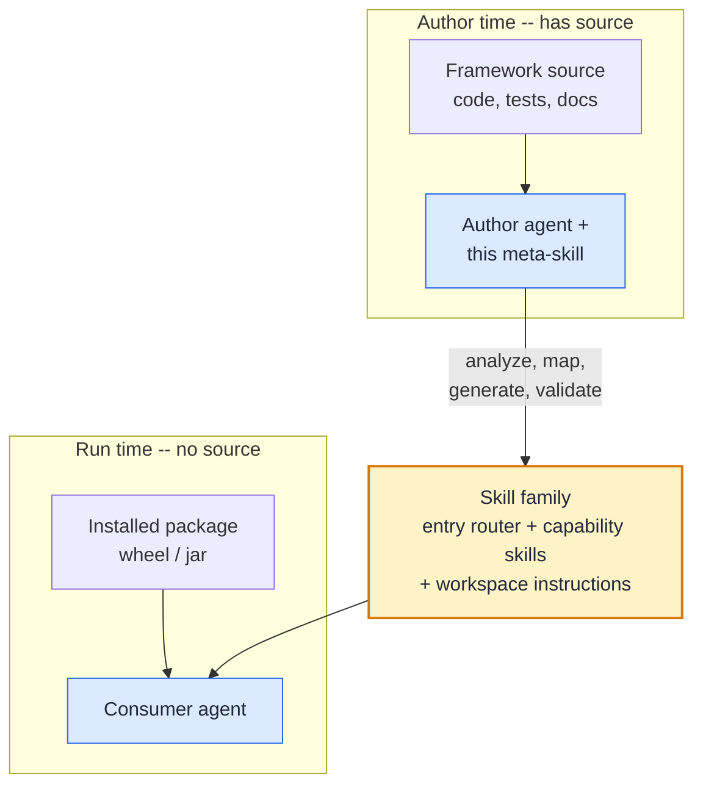

# framework-skill-authoring

A **meta-skill**: a skill that builds skills.

Point it at a framework you have the **source** for, and it generates a
self-contained Agent Skills family that another agent can use later with only
the **installed package** (wheel/jar) — no source, no repo, no docs.


Most "how to make a skill" guides stop at step 1. This repo is step 2.

It's geared mainly toward **data engineering** frameworks, but works just as
well for ML/data-science libraries or anything you'd typically run on
Databricks. The capability taxonomy is broad enough to map most code
frameworks.



## This repository

```
framework-skill-authoring/
├── SKILL.md              # meta-skill entry point
├── references/           # phase-by-phase playbook
└── assets/templates/     # ready-to-fill skeletons
```

Install this meta-skill by placing `framework-skill-authoring/` in your agent's
skills directory (e.g. `~/.agents/skills/`).

## Usage

Open the target framework's codebase and run:

```
use framework-skill-authoring, and based on it, and available files in the
repo build me skills for <your framework> framework
```

Then verify:

```
verify correctness of everything you built vs the code/docs — no
hallucinations, invalid references, or typos in function/attribute names
```

The agent must have the framework **source**; it can't author from a black box.

**Recommended setup:** run the main agent on Claude Opus 4.8 Thinking at the
highest reasoning level you can afford for the best results, and let cheaper/
faster models handle scanning and subagent exploration. This works best in
Cursor, which auto-spawns Composer for the exploratory work.

## How it works

DE frameworks surface as **metadata** (pipeline YAML, entity models) or
**libraries** (APIs you call in notebooks) — often a mix. Either way the surface
is enum-heavy: load semantics, layers, quality severity, deploy modes. A notebook
agent with only the wheel guesses wrong (`upsert` vs `append`, SCD Type 2 in the
wrong layer, `warn` when you meant quarantine). The taxonomies are the same
either way; this meta-skill reads the **source** and encodes them for a
**source-blind consumer**. Four phases:

1. **Analyze** — inventory the DE surface: public API and/or declarative models
   + examples from tests; config (catalog, paths, env — never hardcode
   `prod_catalog.schema.table`); deploy CLI and runtime catalogs; journeys from
   integration tests (onboard → bronze → silver with CDC/SCD → expectations →
   schedule → offboard); branch points (incremental vs CDC, SCD 1 vs 2, inline
   expectations vs quality library, batch vs streaming, draft vs prod).

2. **Map** — two checklists. **Capability taxonomy**: which *skills* to emit
   (authoring, connectors, quality, reconciliation, orchestration, RLS,
   exploration, offboarding) — has it → emit, doesn't → skip. **Conceptual
   taxonomies**: enums to inline verbatim (medallion layers, full/incremental/
   CDC/append, SCD 1/2, system columns, warn/drop/quarantine, DLT vs batch,
   cron vs continuous, dev→prod promotion) — term → values → default →
   consequence at the point of use.

3. **Generate** — workspace-instructions file, entry router (with decision
   trees), one skill per in-scope capability; place vocabularies in the skills
   that own them; self-containment pass (no source paths, inline examples, wire
   runtime doc APIs).

4. **Validate** — structural lint, leakage scan, source-blind dry-runs of each
   journey ("land CDC source", "add quarantine check", "schedule nightly"); fix
   gaps and re-run until clean.

Once generation is done, tune further with your own domain knowledge — add or
remove capability domains, split or merge skills, and sharpen examples to match
how your teams actually use the framework.

**Golden rule:** everything the consumer needs lives inside the skills — no
source paths, copy-pasteable examples, cross-link by skill name, no org leakage.

## Example output

A skill family for a framework with prefix `<fw>` (e.g. its import name):

```
<deploy-root>/
├── workspace-instructions.md         # always-injected: "read <fw> first" + recovery
└── skills/
    ├── <fw>/                          # entry router: decision tree + skill index
    │   ├── SKILL.md
    │   ├── references/                # config/paths, migration, deep refs
    │   └── assets/templates/          # starter configs the consumer copies
    ├── <fw>-onboarding/               # one skill per in-scope capability
    │   └── SKILL.md
    ├── <fw>-data-quality/
    │   └── SKILL.md
    ├── <fw>-orchestration/
    │   ├── SKILL.md
    │   └── reference.md               # sub-guide (progressive disclosure)
    └── <fw>-governance/
        └── SKILL.md
```

Only the domains the framework actually has get emitted.

## Installing the generated skill family

The output is a folder of skills. Drop it where your consumer agent reads skills:

- **Local agent (Claude, Cursor, etc.):** copy each generated skill folder into
  `~/.agents/skills/` (or the project's `.agents/skills/`).
- **Databricks Genie Code:** put each skill folder under `.assistant/skills/` —
  `Workspace/.assistant/skills/` for workspace-wide, or
  `/Users/{username}/.assistant/skills/` for personal. Each skill needs its own
  folder with a `SKILL.md`. Genie Code loads them in Agent mode; start a new
  thread after edits. See
  [Extend Genie Code with agent skills](https://docs.databricks.com/aws/en/genie-code/skills).

## Databricks: install the framework on compute

The skills teach an agent to *use* a framework; the framework's in-scope
libraries still need to be installed on the compute that runs the code, on both
clusters and serverless.

- **Clusters:** trivial — add the framework and its in-scope libraries as
  [cluster libraries](https://docs.databricks.com/aws/en/libraries/cluster-libraries)
  so every notebook and job on the cluster can import them.
- **Serverless:** have an admin set up a workspace-wide
  [base environment](https://docs.databricks.com/aws/en/admin/workspace-settings/base-environment)
  with those libraries. When serverless is selected it loads automatically, so
  users avoid the runtime errors they'd hit running serverless without the
  custom libs.

## Workshop

Want to run this as a workshop (or try it yourself)? The [`workshop/`](workshop/)
folder has ready-to-present material that builds a real library's skill family
from its source code, so a source-blind consumer with only the installed wheel
can use it, using [DQX](https://github.com/databrickslabs/dqx)
(`databricks-labs-dqx`) as the demo. See [`workshop/README.md`](workshop/README.md)
for the files and flow:

- [`workshop/requirements.md`](workshop/requirements.md) — what to prepare
  **before** the workshop: a laptop, an agent (Cursor / Claude Code), and a
  Databricks workspace. Local Databricks Connect is optional; a notebook is
  enough to run generated code.
- [`workshop/skill-authoring-deck.md`](workshop/skill-authoring-deck.md) — theory
  and practice: 3 theory sections + the same 3 points applied to DQX.
- [`workshop/exercises.md`](workshop/exercises.md) — the hands-on exercises:
  (1) watch Genie Code fail at DQX with no skill, (2) drop in a tiny skill and
  watch it get smart, (3) build DQX's skill family from its source so a wheel-only
  consumer can use it, then deploy to Genie Code.
- [`workshop/testing-skills-with-subagents.md`](workshop/testing-skills-with-subagents.md) —
  how to prove a skill works: spawn source-blind sub-agents that must produce
  runnable code from the skill alone (rubric + execution gates).
