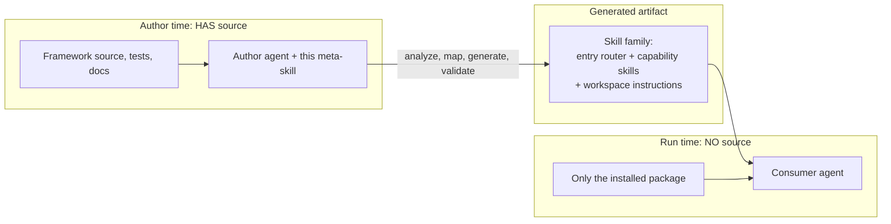

# Framework Skill Authoring

This is a **meta-skill**: a skill that builds skills. Point it at any code
framework or library you have the **source** for, and it produces a
**self-contained Agent Skills family** that a different agent can use later
with only the **installed package** (a wheel, jar, or equivalent) -- no
source, no repo, no docs site.

You are the **author agent**. You have the source. Your job is to capture
everything a future **consumer agent** would need, and bake it into skills,
because the consumer will not be able to read the code.

## When to use this skill

- "Create Agent Skills for `<framework>`."
- "Make `<library>` usable by an AI assistant that only has it installed."
- "Reverse-engineer this codebase into a skill family."
- "Build an entry-router skill and capability skills for our framework."
- "Document `<framework>` so an in-notebook / in-IDE assistant can drive it."

If the user only wants ONE simple skill for a narrow task, use a plain
skill-authoring approach instead -- this meta-skill is for producing a
**whole family** that exposes a framework.

## The two-agent model (why self-containment is everything)



The consumer agent typically runs where the package is installed but the
repo is not: a data-platform notebook assistant, an IDE assistant, or a CLI
agent that reads skills from the Agent Skills standard directory. It can run
code and call the package's public API, but it **cannot** open your source
files.

## Golden rule: write for the source-blind consumer

Everything the consumer needs must live **inside the generated skills**.

- NO references to source file paths (`src/...`, `tests/...`, internal module
  files). They do not exist for the consumer.
- ALL code examples are complete and copy-pasteable, never "see file X".
- Cross-reference sibling skills by **skill name**, never by file path.
- If the framework exposes a **runtime documentation / discovery API** (a
  function that returns component or field docs at run time), wire it into
  the skills as the consumer's escape hatch for detail you did not inline.
- Prefer the framework's own public primitives over hand-rolled code; the
  skills exist so the consumer uses the framework instead of bypassing it.

Full rules: [authoring-rules.md](references/authoring-rules.md).

## BEFORE YOU START

1. Read this whole file. It is short on purpose.
2. Confirm you actually have the framework source (repo, or an unpacked
   package with readable code). If you only have the installed package, you
   are the *consumer*, not the author -- you cannot author from a black box.
3. Copy [assets/templates/authoring-plan.md](assets/templates/authoring-plan.md)
   into your own working plan and follow it. Do not write any skill before
   you have filled the inventory.
4. Skim the reference library (table at the bottom) so you know which guide
   answers which question.

## The author-agent agenda

Produce this plan first (template:
[authoring-plan.md](assets/templates/authoring-plan.md)) and work it in order:

1. **Inventory** the framework -- public API, config/settings object, domain
   models, CLI entry points, runtime doc APIs, examples/tests. Fill
   [capability-inventory.md](assets/templates/capability-inventory.md).
2. **Map** the inventory to the capability taxonomy and decide which skills
   to emit. Skip domains the framework lacks.
3. **Extract** the conceptual vocabularies (layers, load semantics, modes,
   severities, env tiers, technical columns, ...).
4. **Draft** the entry-router decision tree(s) from the framework's real
   decision points.
5. **Author** the workspace-instructions file and the entry router.
6. **Author** one capability skill per in-scope domain.
7. **Self-containment pass** -- strip source paths, inline examples, wire the
   runtime doc API, cross-link siblings by name.
8. **Validate** -- structural lint + a no-source consumer simulation per
   critical user journey (CUJ).
9. **Iterate** on gaps; mark contributor-only domains out of scope for the
   consumer.

## The four phases

### Phase 1 -- Analyze (you have the source)

Inventory what the framework can do and how a user drives it. The signals to
read and how to read them are in
[analyze-framework.md](references/analyze-framework.md). Output: a filled
[capability-inventory.md](assets/templates/capability-inventory.md).

### Phase 2 -- Map to the universal taxonomy

For each capability domain, decide: does the framework have it? If yes, emit
a skill from the capability template; if no, skip it. The de-branded domain
checklist and mapping rules are in
[universal-taxonomy.md](references/universal-taxonomy.md). While mapping, also
record the framework's **conceptual vocabularies** using
[conceptual-taxonomies.md](references/conceptual-taxonomies.md) -- these are
the enumerations (load types, modes, severities, ...) a source-blind agent
will never guess.

### Phase 3 -- Generate the family

Emit, in this order, using the templates and the
[skill anatomy](references/skill-anatomy.md):

1. The **workspace-instructions** file
   ([template](assets/templates/workspace-instructions.md)).
2. The **entry router** skill
   ([template](assets/templates/entry-router.SKILL.md)) -- decision tree,
   mental model, quick references, skill index, config/paths rules. Build its
   decision trees from [decision-tree-patterns.md](references/decision-tree-patterns.md).
3. One **capability skill** per in-scope domain
   ([template](assets/templates/capability.SKILL.md)).

### Phase 4 -- Validate

Lint structure, then simulate a source-blind consumer doing each CUJ with
only the skills + installed package. Fix gaps and repeat. Procedure:
[validate-skills.md](references/validate-skills.md).

## What you generate (output layout)

Pick a short, lowercase framework prefix `<fw>` (e.g. the package's import
name). Emit:

```
<deploy-root>/
├── workspace-instructions file      # always-injected: "read <fw> first" + recovery
└── skills/
    ├── <fw>/                         # entry router (decision tree + index)
    │   ├── SKILL.md
    │   ├── references/               # config/paths, migration, deep refs
    │   └── assets/templates/         # starter configs the consumer copies
    ├── <fw>-<capability-a>/
    │   └── SKILL.md
    ├── <fw>-<capability-b>/
    │   ├── SKILL.md
    │   └── <sub-guide>.md            # progressive disclosure when large
    └── ...
```

The exact deploy root and the workspace-instructions mechanism depend on the
consumer platform -- keep both configurable, and never hardcode a specific
vendor path. See [authoring-rules.md](references/authoring-rules.md).

## Naming conventions

- Entry router skill name = `<fw>` (the framework prefix alone).
- Capability skill name = `<fw>-<capability>`, lowercase + hyphens, e.g.
  `<fw>-onboarding`, `<fw>-data-quality`, `<fw>-orchestration`.
- `name:` in frontmatter MUST equal the skill's directory name.
- Keep names descriptive, never `helper` / `utils` / `tools`.

## Reference library

| Guide | Read it when |
|-------|--------------|
| [analyze-framework.md](references/analyze-framework.md) | Phase 1: extracting capability signals from source |
| [universal-taxonomy.md](references/universal-taxonomy.md) | Phase 2: which capability skills to emit |
| [conceptual-taxonomies.md](references/conceptual-taxonomies.md) | Phase 2: the domain vocabularies to capture verbatim |
| [decision-tree-patterns.md](references/decision-tree-patterns.md) | Phase 3: building decision trees for the router + skills |
| [skill-anatomy.md](references/skill-anatomy.md) | Phase 3: section-by-section structure of each SKILL.md |
| [authoring-rules.md](references/authoring-rules.md) | Throughout: self-containment + good descriptions |
| [validate-skills.md](references/validate-skills.md) | Phase 4: lint + no-source consumer simulation |

## Templates

| Template | Purpose |
|----------|---------|
| [authoring-plan.md](assets/templates/authoring-plan.md) | The agenda you copy into your own plan |
| [capability-inventory.md](assets/templates/capability-inventory.md) | Phase 1 analysis artifact you fill in |
| [workspace-instructions.md](assets/templates/workspace-instructions.md) | The always-injected instructions file |
| [entry-router.SKILL.md](assets/templates/entry-router.SKILL.md) | The framework's top-level router skill |
| [capability.SKILL.md](assets/templates/capability.SKILL.md) | One granular capability skill |
